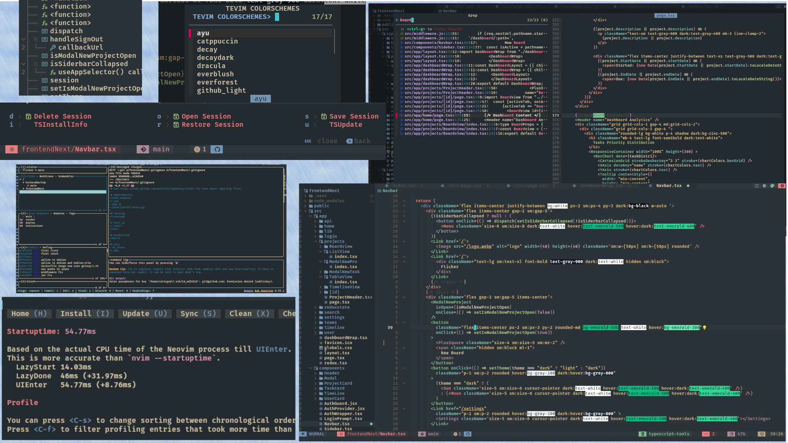

<h1 align="center">NeoVim Web Dev Edition (TeVim)</h1>

<div align="center">


</div>



<div align="center">

```txt
Performance for time startup on laptop
LazyStart                           : 14ms - 20ms
UiEnter                              : 70ms - 100ms
```

</div>
<h5> Themes Showcase with 16 colorschemes </h5>

|  |  |  |  |
| :-------------------------------------------------------------------------------------------------------------------------------: | :-------------------------------------------------------------------------------------------------------------------------------: | :-------------------------------------------------------------------------------------------------------------------------------: | --------------------------------------------------------------------------------------------------------------------------------- |
|  |  |  |  |
|  |  |  |  |
|  |  |  |  |

</details>

## 🔎 Requirements

- Neovim >= v0.11.+ .

- Nerd Font as your terminal font.

- `Ripgrep` and `Fzf` are required for grep searching with Fzf-lua.

- `GCC (Clang)`, **Windows** users must have `mingw` installed and set on PATH.

- `Lazygit` and `Ranger` (OPTIONAL).

- `Xsel` and `Xclip` for copy and paste (X11), `wl-clipboard` (Wayland) (OPTIONAL).

## ⬇️  Installation

#### Linux
- Backup your config
  ```zsh
  mv ~/.config/nvim ~/.config/nvim.bak
  ```
- Remove cache setup
  ```zsh
  rm -rf ~/.local/share/nvim ~/.local/state/nvim ~/.cache/nvim
  ```
- Install TeVim
  ```zsh
  git clone https://github.com/theayusharma/NeoVim ~/.config/nvim --depth 1 && nvim
  ```

- Adding Mason to PATH
  ```zsh
  # this is for zsh
  export PATH=$PATH:~/.local/share/nvim/mason/bin
  ```

#### Windows (PowerShell)
- Backup your config
  ```powershell
  Move-Item $env:LOCALAPPDATA\nvim $env:LOCALAPPDATA\nvim.bak
  ```
- Remove cache setup
  ```powershell
  Move-Item $env:LOCALAPPDATA\nvim-data $env:LOCALAPPDATA\nvim-data.bak
  ```
- Install TeVim
  ```powershell
  git clone https://github.com/theayusharma/NeoVim $env:LOCALAPPDATA\nvim --depth 1 && nvim
  ```

#### Custom Colorschemes
> Read file colorschemes on tevim/themes/schemes/ and write like it on custom/themes/schemes/

#### TeVim Commands
> **TeVimThemes** : Open list colorschemes
>
> **TeVimToggleTrans** : Toggle Transparency
>
> **TeVimCheckMason** : Install or Remove package you add or remove on custom/configs/overrides.lua
>
> **TeVimUpdate** : Update TeVim (If you have any problems, please create issues)

<br>

## Plugins

| Plugin                                                                              | Description                                                                 | Plugin                                                                                             | Description                                                                 |
| ----------------------------------------------------------------------------------- | --------------------------------------------------------------------------- | -------------------------------------------------------------------------------------------------- | --------------------------------------------------------------------------- |
| [echasnovski/mini.nvim](https://github.com/echasnovski/mini.nvim)                     | Library of minimal, independent, and fast Lua modules                       | [nvim-tree/nvim-web-devicons](https://github.com/nvim-tree/nvim-web-devicons)         | More devicons for neovim                                                    |
| [nvim-neo-tree/neo-tree.nvim](https://github.com/nvim-neo-tree/neo-tree.nvim)         | A very neat, simple and clean file tree and most features                   | [lukas-reineke/indent-blankline.nvim](https://github.com/lukas-reineke/indent-blankline.nvim) | Shows indent lines in neovim                                                |
| [nvim-treesitter/nvim-treesitter](https://github.com/nvim-treesitter/nvim-treesitter) | Syntax highlighting, most popular one for neovim                            | [folke/todo-comments.nvim](https://github.com/folke/todo-comments.nvim)               | Beautiful highlights for TODO comments                                      |
| [ibhagwan/fzf-lua](https://github.com/ibhagwan/fzf-lua)                               | An improved and tightly integrated fzf experience within Neovim             | [stevearc/dressing.nvim](https://github.com/stevearc/dressing.nvim)                   | A Neovim plugin to improve the default vim.ui interfaces                    |
| [numToStr/Comment.nvim](https://github.com/numToStr/Comment.nvim)                     | Quick and easy commenting                                                   | [folke/which-key.nvim](https://github.com/folke/which-key.nvim)                       | A Neovim plugin that shows a popup with keybindings                           |
| [akinsho/toggleterm.nvim](https://github.com/akinsho/toggleterm.nvim)                 | Terminal integration in neovim                                              | [lewis6991/gitsigns.nvim](https://github.com/lewis6991/gitsigns.nvim)                 | Super fast git decorations implemented purely in Lua                        |
| [RRethy/vim-illuminate](https://github.com/RRethy/vim-illuminate)                     | Highlights all instances of the word under the cursor                       | [kevinhwang91/ufo.nvim](https://github.com/kevinhwang91/ufo.nvim)                     | A Neovim plugin that provides a foldable and scrollable buffer              |
| [luukvbaal/statuscol.nvim](https://github.com/luukvbaal/statuscol.nvim)               | A configurable statuscolumn and click handlers                              | [hrsh7th/nvim-cmp](https://github.com/hrsh7th/nvim-cmp)                               | Autocompletion plugin for neovim                                            |
| [neovim/nvim-lspconfig](https://github.com/neovim/nvim-lspconfig)                     | The most popular LSP client for neovim                                      | [catgoose/nvim-colorizer prev nvchad/~](https://github.com/catgoose/nvim-colorizer.lua)             | Highlights colors and is really frickin fast                                |
| [mg979/vim-visual-multi](https://github.com/mg979/vim-visual-multi)                   | A multiple cursors plugin for Vim and Neovim                                | [iamcco/markdown-preview.nvim](https://github.com/iamcco/markdown-preview.nvim)       | A markdown preview plugin for Vim and Neovim                                |
| [karb94/neoscroll.nvim](https://github.com/karb94/neoscroll.nvim)                     | A Neovim plugin that provides smooth scrolling                              | [pmizio/typescript-tools.nvim](https://github.com/pmizio/typescript-tools.nvim)       | A Neovim plugin for TypeScript development                                  |
| [windwp/nvim-ts-autotag](https://github.com/windwp/nvim-ts-autotag)                   | Automatically close and rename html tags                                    | [windwp/nvim-autopairs](https://github.com/windwp/nvim-autopairs)                     | Automatically close and rename brackets                                     |
| [rmagatti/auto-session](https://github.com/rmagatti/auto-session)                     | A session manager for Neovim                                                | [MunifTanjim/nui.nvim](https://github.com/MunifTanjim/nui.nvim)                       | A UI component library for Neovim                                           |
| [mattn/emmet-vim](https://github.com/mattn/emmet-vim)                                 | A Vim plugin that provides support for expanding abbreviations, similar to Emmet |


## Keybinds

| Keys        | Function          |
| ------------- |-------------|
| <kbd>CTRL</kbd> <kbd>h</kbd> / <kbd>j</kbd> / <kbd>k</kbd> / <kbd>l</kbd> | Moving Window Focus Towards Left/Up/Down/Right (Normal) |
| <kbd>CTRL</kbd> <kbd>h</kbd> / <kbd>j</kbd> / <kbd>k</kbd> / <kbd>l</kbd> | Moving Cursor Left/Up/Down/Right (Insert) |
| <kbd>CTRL</kbd> <kbd>e</kbd> | Toggle Explorer with Neotree |
| <kbd>CTRL</kbd> <kbd>`</kbd> | Open And Close ToggleTerm |`
| <kbd>ALT</kbd> / <kbd>⬇️</kbd> / <kbd>⬆️</kbd> | Moving Current Line or Lines Down/Up |
| <kbd>Enter</kbd> | Clear Highlight Search |

#### File Operations

| Keys        | Function          |
| ------------- |-------------|
| <kbd>LDR</kbd> <kbd>q</kbd> | Exit Neovim |
| <kbd>CTRL</kbd> <kbd>s</kbd> | Save File (N + I) |
| <kbd>CTRL</kbd> <kbd>q</kbd> | Close Current Buffer |
| <kbd>CTRL</kbd> <kbd>o</kbd> | Close Other Buffer |
| <kbd>TAB</kbd>               | Next Buffer |
| <kbd>SHIFT</kbd> <kbd>TAB</kbd> | Previous Buffer |
| <kbd>CTRL</kbd> <kbd>/</kbd> | Toggle Comment (N + I + V) |

#### Fzf-lua (Previously Telescope)

| Keys        | Function          |
| ------------- |-------------|
| <kbd>LDR</kbd> <kbd>f</kbd> <kbd>f</kbd> | Find Files |
| <kbd>LDR</kbd> <kbd>f</kbd> <kbd>r</kbd> | Find Recently Visited Files |
| <kbd>LDR</kbd> <kbd>f</kbd> <kbd>w</kbd> | Find File By String |
| <kbd>LDR</kbd> <kbd>f</kbd> <kbd>t</kbd> | TODO |

<br>

> More keybinds at [keybinds](https://github.com/theayusharma/Neovim/blob/master/Keybind.md)

<br>

<details><summary> <b>Credits</b></summary>

- [Original Guy sownteedev](https://github.com/sownteedev/TeVim) I used his config as my base config


</details>
